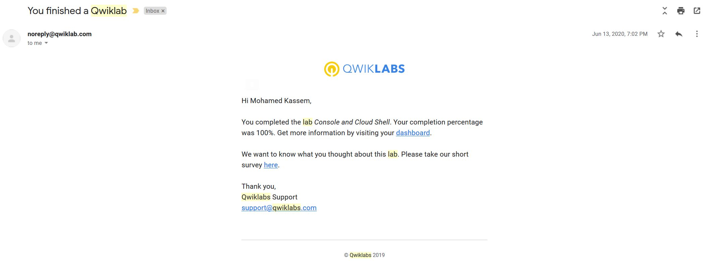

```
<meta name="robots" content="noindex">
```

## Labs screenshots proof of completion:


1. Console and Cloud Shell



2. Infrastructure Preview


3. VPC Networking


4. Implement Private Google Access and Cloud NAT


5. Creating Virtual Machines


6. Working with Virtual Machines
