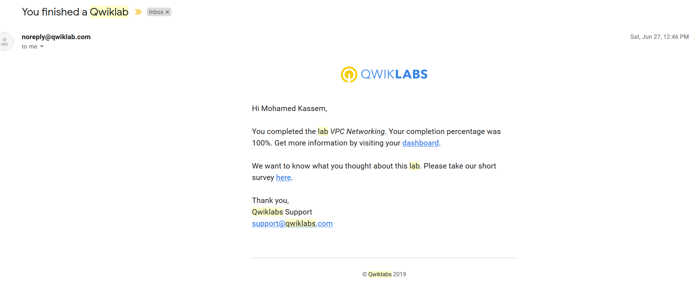
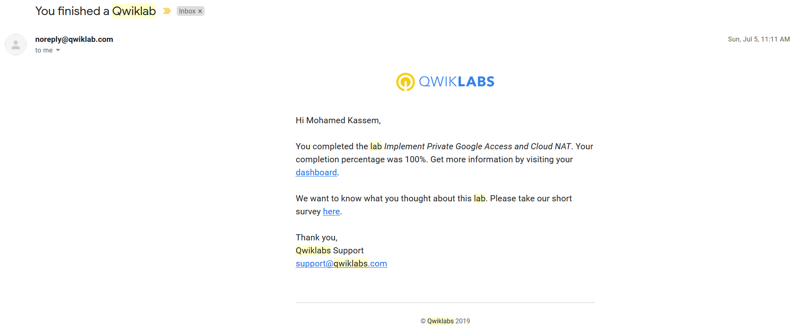
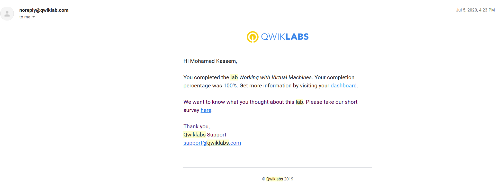

## Labs screenshots proof of completion:

1. Console and Cloud Shell

2. Infrastructure Preview

3. VPC Networking

4. Implement Private Google Access and Cloud NAT

5. Creating Virtual Machines

6. Working with Virtual Machines

7. Cloud IAM

8. Cloud-Storage

9. Implementing Cloud SQL

10. Introduction to Containers and Docker v1.6

11. Virtual Private Networks (VPN)

12. Configuring an HTTP Load Balancer with Autoscaling

13. Configuring an Internal Load Balancer

14. Automating the Deployment of Infrastructure Using Deployment Manager

15. Google Cloud Fundamentals: Getting Started with GKE
