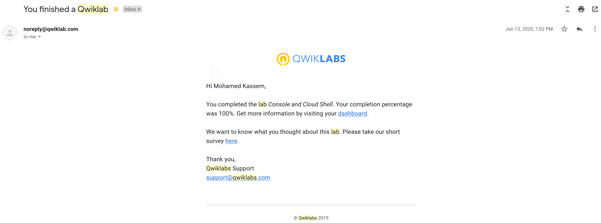
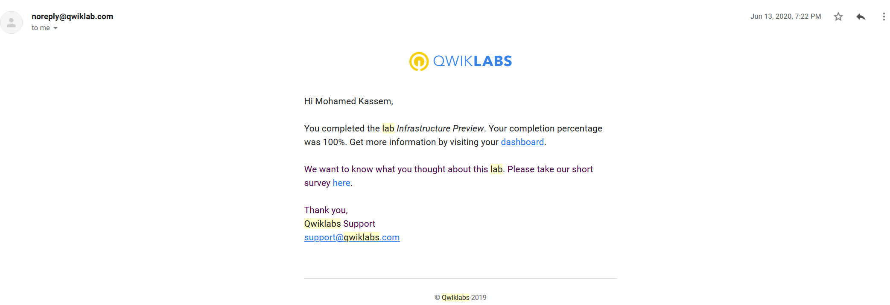
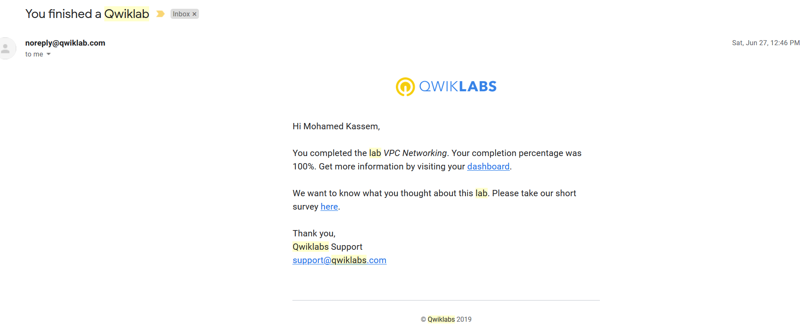
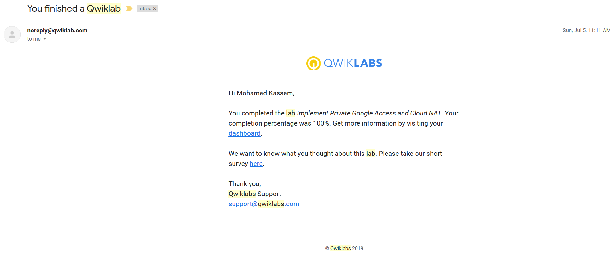
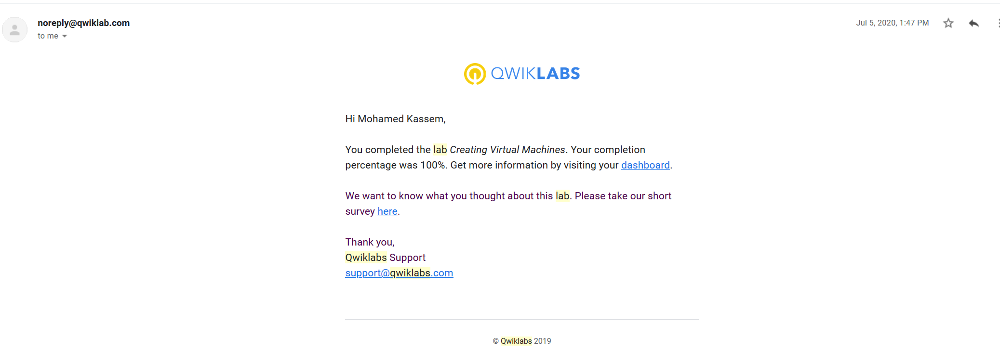
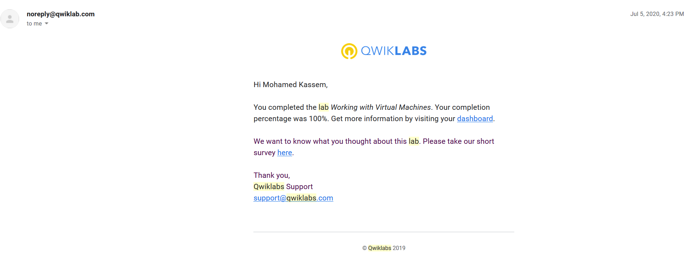

## Labs screenshots proof of completion:

1. Console and Cloud Shell

2. Infrastructure Preview

3. VPC Networking

4. Implement Private Google Access and Cloud NAT

5. Creating Virtual Machines

6. Working with Virtual Machines
